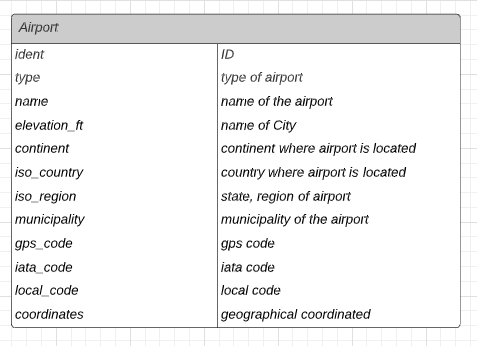
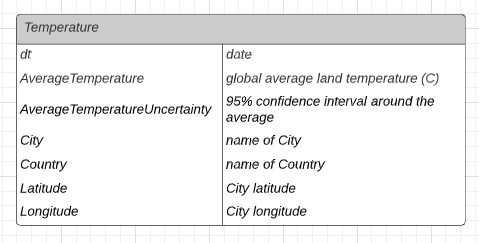
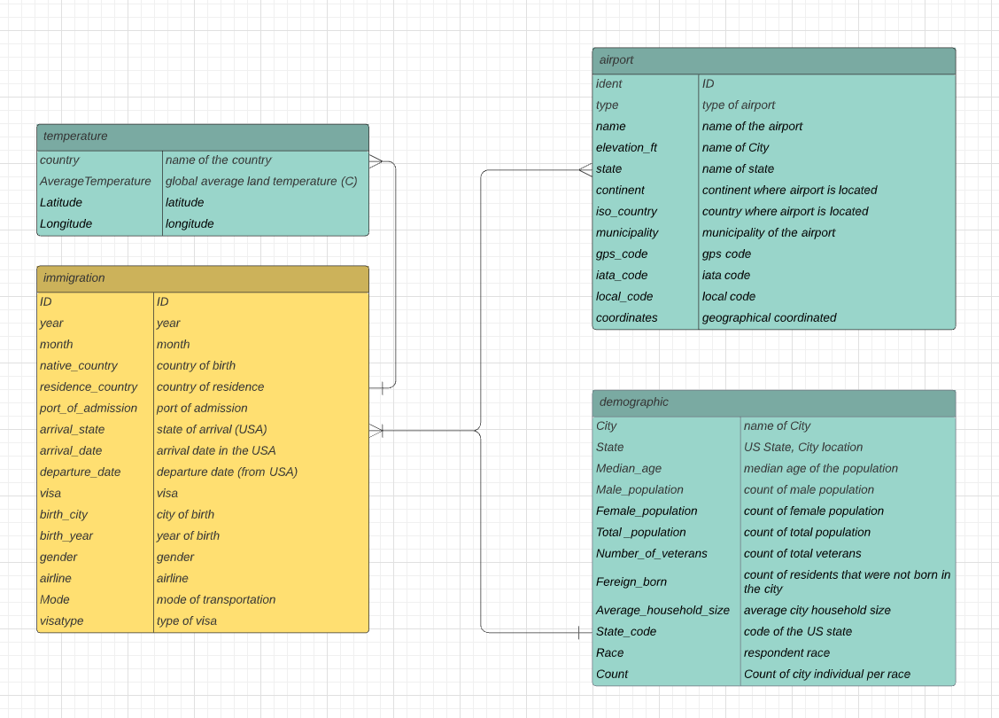

# Data Engineerging Capstone Project

## Summary

The aim of the project was to create an ETL pipeline for airport, demographics and weather datasets to form an database ready to form immigration analytics. The usecase for this data id to find patterns in US immigration. 

## Provided data

Project is based on those datasets:
1. Demographics dataset 
U.S. City Demographic Data: This dataset contains information about the demographics of all US cities and census-designated places with a population greater or equal to 65,000.

2. Immigration dataset (I94 Immigration Data)
This data comes from the US national Tourism and Trade Office. Each report contains udefull information about international visitor arrival, statistics by world regions, type of visa, mode of transportation, age groups, and the top ports of entry.

3. Airport dataset
This tables contains airport codes with corresponding cities.

4. Temperature dataset
This dataset includes information about temperature in cities.

## Files (FILL)

* images - folder with images used in README.md
* capstone project template.ipynb - jupyter notebook used for building an ETL pipeline
* cred.cfg - contains AWS credentials
* etl.py - reads data from S3, processes the data using Spark and create tables back to S3
* lookup folder with tables containg codes and abbreviations explanations

## Project schema

* Step 1: Scope the Project and Gather Data
* Step 2: Explore and Assess the Data
* Step 3: Define the Data Model
* Step 4: Run ETL to Model the Data
* Step 5: Complete Project Write Up

### Step 1
In this step the data was loaded into dataframes using Spark. 

### Step 2

Datasets have been cleaned and prepared for future analysis. Columns with sagnificant amounts of missing data were removed and there were performed many operations like changing data types or renaming columns for better data understanding. The column with city data needed changing city code for name of the city. It was done by joining previously done .csv file cointaining this translation. Similar situation was concerned in the modes of transport and types of visa cases.

### Step 3

#### Conceptual data model

Database is created in star schema. There are one fact table and three dimension tables. The tables and links between them are presented below:

 Immigration table is the origin of the center of this model. The immigration fact table is based on this dataset. Demografic dimension table with the information about population is connected with fact table at the state level. To create this link it was necessary to join table with full states names table. Airport dimension table which contains detailed information about airports is linked to the immigration fact table at the state level. To make this connection creating a column with state data was needed. Temperature dimension table is linked with immigration dimension table at the country level.

#### Mapping out data pipelines

To accomplish all the tasks related to the preprocessing of the datasets it was developed a number of functions in etl.py. The open-source framework Apache Spark was the main tool used. Spark provides an interface for programming entire clusters with implicit data parallelism and fault tolerance.

##### Immigration 
The preprocessing of the main dataset immigration starts by loading the immigration data from the SAS file as well as lookup files and was completed by generating and the storing of the processed dataframes to a bucket in Amazon S3. In summary, the following tasks are performed throughout the process:

- loading of the immigration file into Spark dataframe. Only useful columns was loaded. In particular  the follouwing fields: "count", "entdepa", "entdepd", "matflag", "fltno", "dtaddto", "admnum", "i94bir", "dtadfile" was discarded
- high missing value columns "visapost", "occup", "entdepu" and "insnum" was dropped
- though some columns were actually of Integer type, the Spark framework loaded them as double or strings. To correct this we convert those fields to the proper class
- the dates in the immigration dataframe are stored in SAS date format, which is a value that represents the number of days between January 1, 1960, and a specified date. The dates in the dataframe was converted to a string date format in the pattern YYYY-MM-DD
- the visa types and modes of transport was changed for verbal meaning by joining lookup files
- the arrival_country and residential_country was changed for city names
- the processed immigration fact dataframe was saved to the Amazon S3 in the parquet format

##### Temperature
The generation of the temperature dataset starts by loading the data global temperature dataset and was completed by generating and the storing of the processed dataframe to a bucket in Amazon S3. In summary, the following tasks was performed throughout the process:

- loading of the csv file of the global temperature
- aggregation of the temperatures dataset by country
- Saving the resulting dataset to the staging area in Amazon S3

##### Airport
The generation of theairport dataset starts by loading the airport dataset and was completed by generating and the storing of the processed dataframe to a bucket in Amazon S3. In summary, the following tasks was performed throughout the process:

- loading of the csv file of the airport table
- the iso_region column was transformed to state column by limiting the airports to those located in the US and the state data was extracted.
- saving the resulting dataset to the staging area in Amazon S3

##### Demographics
The generation of the demographics dataset starts by loading the data in demographics dataset and is completed by generating and the storing the processed dataframe to a bucket in Amazon S3. In summary, the following tasks are performed throughout the process:

- loading of the csv file of the demographics
- Aggregating the demographics dataset by state and rename new columns
- saving the resulting dataset to the staging area in Amazon S3

Once the parquet files are saved in the S3 bucket in the AWS, those are used to load the tables of the same name in the Amazon Redshift. We create the schema by running the SQL script found in sql/create_tables.sql. From there, our model is ready to be explored by the customers whether through open query editor in Redshift itself or using a dashboard tool such as Tableau or Power BI.

### Step 4

The whole pipeline is divided into two stages. The first, where spark was used to load, extract, transform and store the provided datasets into the AWS S3 staging area. The second stage was taking advantage of Apache Airflow to build a DAG to extract data from S3 and load them into tables of the same name in Amazon Redshift. As a final step the data counting was checked to ensure completeness.

### Step 5

Clearly state the rationale for the choice of tools and technologies for the project.

The whole solution implemented here was using computing technology, AWS in particular. Because the cloud computing provides a secure, stable, scalable, and highly reliable infrastructure platform in the cloud this is a natural choice for every new solution like was made here. Every used service (S3, EMR, Redshift) has reasonable cost and is ‘pay as you go’, transparent pricing. So we can start small and scale as our solution grows. No up-front costs involved.

In particular, why we use the following services:

#### Spark

This is simply the best framework for big data processing, with built-in modules for streaming, SQL, machine learning and graph processing. Spark provides an interface for programming entire clusters with implicit data parallelism and fault tolerance. Most of our team are pythonians and Spark has a very convenient API for python programmers to use.

#### S3

Provides a relatively cheap, secure, ready-to-use and easy-to-use data storage.

#### EMR 

This is a cloud-native big data platform, allowing teams to process vast amounts of data quickly, and cost-effectively at scale using Spark. EMR is easy-to-use, secure, elastic and low-cost.

#### Redshift

Redshift provides a massively parallel, column-oriented data warehouse that provides easy-scale functionality. The main analytical tools have native interface to load from Redshift.

Propose how often the data should be updated and why

The model should be updated monthly.

Write a description of how you would approach the problem differently under the following scenarios:

* The data was increased by 100x:
Scaling the whole pipeline should not be a problem. Since the whole solution is on top of Amazon cloud, that are easily scalable, the only thing we would need to do is increase the number of nodes of the clusters in EMR to hadle more data. 

* The data populates a dashboard that must be updated on a daily basis by 7am every day.
The runnig interval of the Airflow DAG could be changed to daily and scheduled  to make the data available at 7am.

* The database needed to be accessed by 100+ people.
Redshift enables us to add or remove nodes in an Amazon Redshift cluster. This further increases the agility to get better performance and more storage for demanding workloads, and to reduce cost during periods of low demand.
